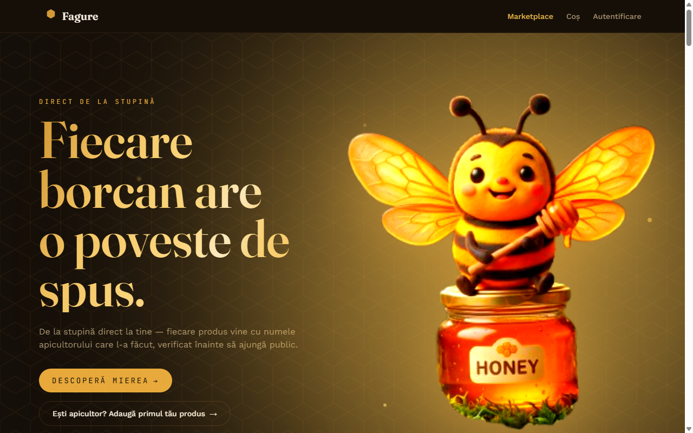
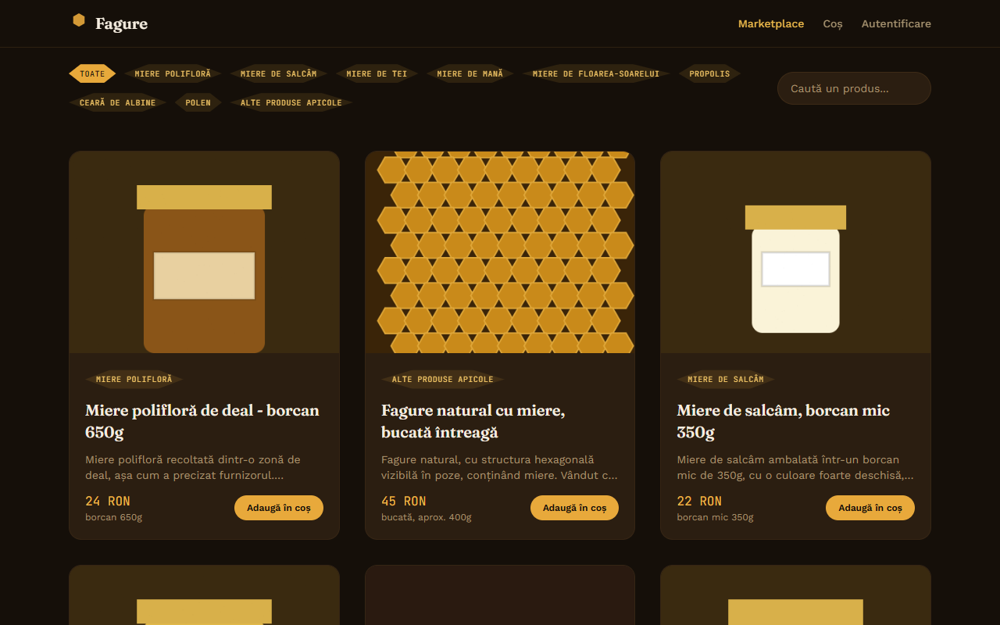
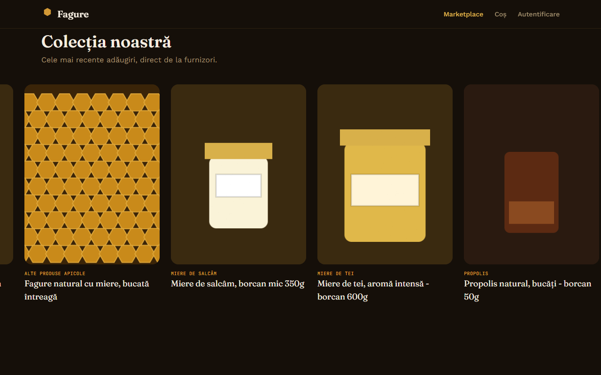
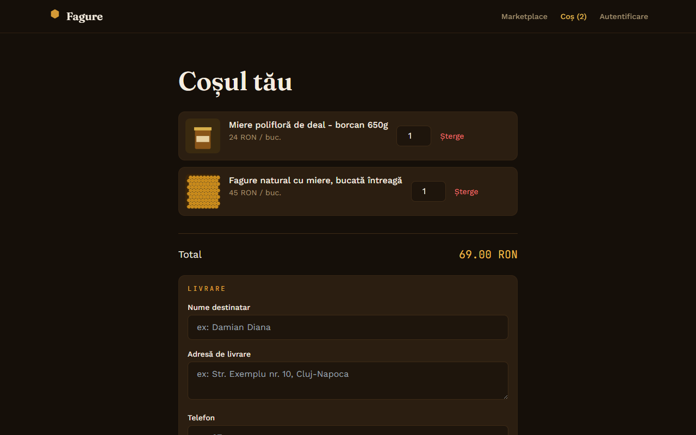
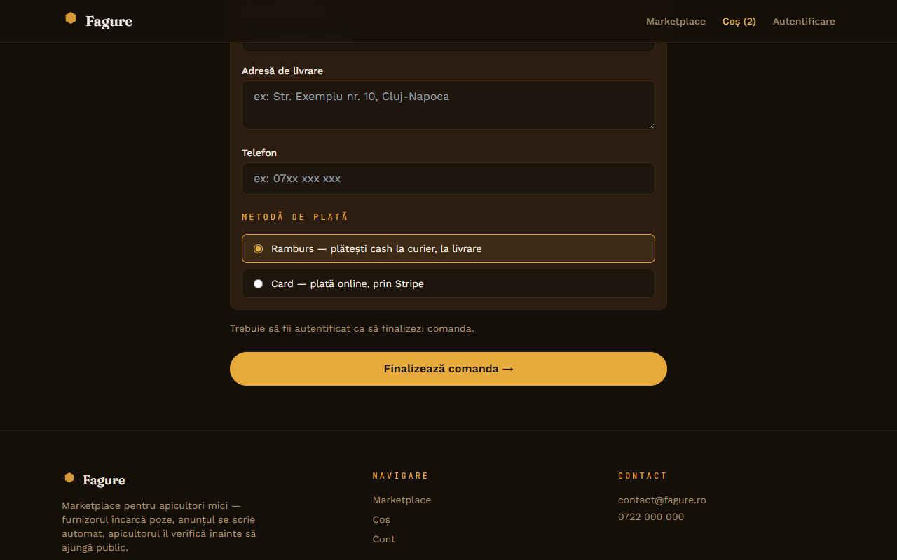
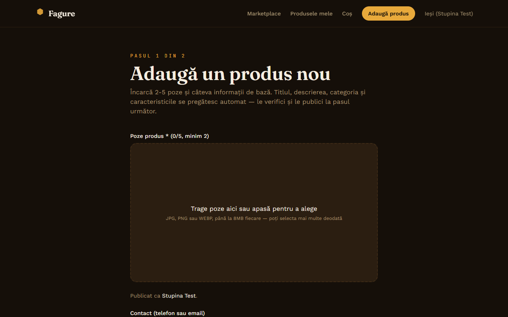
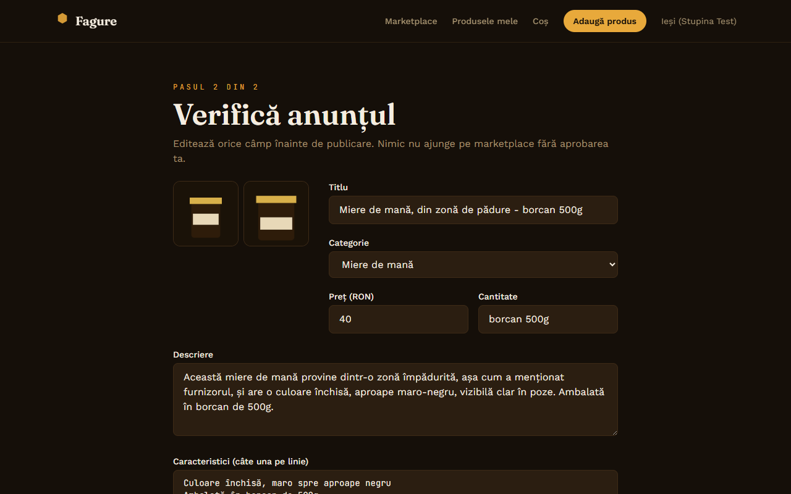
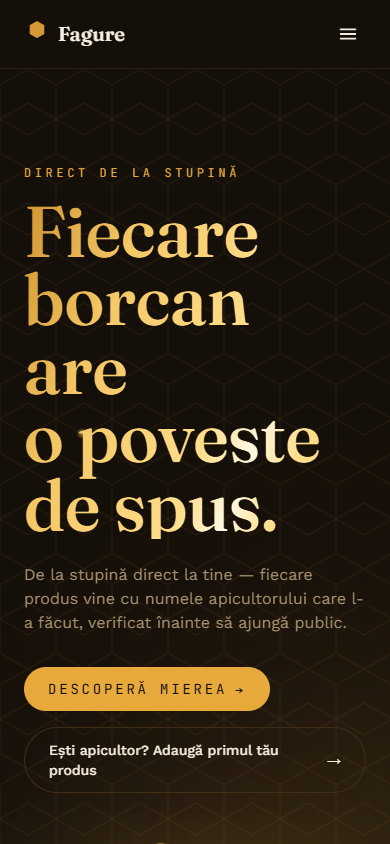
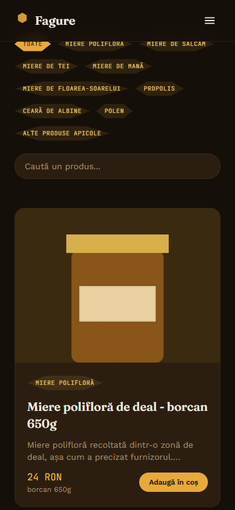

# 🍯 Fagure — marketplace de miere (prototip funcțional)

Prototip local pentru un marketplace unde apicultori mici își pot lista produsele.
Furnizorul încarcă 2-5 poze + câteva informații brute, un modul AI (Claude Vision,
arhitectură agentică — vezi secțiunea 3) generează automat titlul, descrierea
(structurată, în până la 3 părți), categoria și caracteristicile, furnizorul
verifică/editează, apoi publică pe marketplace-ul public.

Are conturi reale (furnizor/cumpărător/admin, parole hash-uite bcrypt), coș +
checkout complet (adresă de livrare, plată ramburs sau card prin Stripe Checkout
în mod test), stoc pe produs cu oprire manuală a vânzării, și un panou de admin
cu statistici și jurnal de activitate.

Pentru raționamentul complet din spatele fiecărei decizii — inclusiv o revizuire
majoră de scop, auditurile de accesibilitate/mobil/UX, și toate bug-urile și
vulnerabilitățile găsite și reparate pe parcurs — vezi [`DECISIONS.md`](./DECISIONS.md)
(jurnal cronologic, ~800 linii). Un rezumat de o pagină e în [`SUMAR.md`](./SUMAR.md).

**Marketplace**

<p align="center">
  
  
  
  
  
  
</p>
<p align="center"><em>↑ pe site e video, cu redare automată în buclă — aici e doar un cadru static, capturat pentru README.</em></p>

**Fluxul AI (furnizor)**

<p align="center">
  
  
</p>

**Mobil (375-390px)**

<p align="center">
  
  
</p>

---

## 1. Funcționalități, punct cu punct

| Funcționalitate | Unde e implementată |
|---|---|
| Furnizorii încarcă poze + informații de bază | `client/src/pages/SupplierUpload.jsx` → `POST /products/analyze` (`server/routes/products.js`) — 2-5 poze, `multer`, disc local |
| AI analizează imaginile + info și pregătește produsul (titlu, descriere, categorie, caracteristici) | `server/services/aiAnalyzer.js` — pipeline agentic Generator + Evaluator-Optimizer + validare, detaliat în secțiunea 3 |
| Furnizorul verifică și editează înainte de publicare | `client/src/pages/SupplierReview.jsx` → `PATCH /products/:id`, apoi `POST /products/:id/publish` — nimic nu ajunge public fără acest pas |
| Pagină de marketplace plăcută și ușor de folosit | `client/src/pages/Marketplace.jsx` — filtrare pe categorie/căutare, grid responsive, rulare automată "Colecția noastră", detalii în secțiunea 4 |
| Rulează local, nu trebuie publicată online | Secțiunea 2 mai jos — `npm run dev` / `npm start`, fără dependențe de infrastructură externă în afară de cheia Anthropic (și, opțional, Stripe) |
| Stack și arhitectură alese și justificate | Secțiunea 5 — clarificările și compromisurile reale, nu doar lista finală |
| Tool-uri AI folosite cu discernământ, rezultate verificate, proces coordonat direct de mine | Secțiunea 6 — cum a fost folosit Claude Code concret, nu doar declarativ |

---

## 2. Cum rulezi proiectul local

Ai nevoie de **Node.js 22.5+** (pentru `node:sqlite`, modulul nativ de bază de
date — vezi secțiunea 3) și o **cheie API Anthropic** (pentru modulul de analiză
imagini). Plata cu cardul (Stripe) e opțională — fără cheie, cardul se
dezactivează automat cu 503, ramburs funcționează neschimbat.

### Backend

```bash
cd server
npm install
# creează un fișier .env cu cel puțin:
# ANTHROPIC_API_KEY=sk-ant-...
# PORT=4000
npm start
```

Restul variabilelor (`SESSION_SECRET`, `ADMIN_EMAIL`/`ADMIN_PASSWORD`,
`STRIPE_SECRET_KEY`, `CLIENT_ORIGIN`, `DEBUG_EVALUATOR_COST`) sunt opționale —
lipsă, se generează/dezactivează automat la prima pornire (detalii în
`server/server.js`).

Pornește pe `http://localhost:4000`. La primul run se creează automat baza de
date SQLite (`server/db/marketplace.sqlite`), folderul `server/uploads/` pentru
poze, și un cont admin (credențialele apar o singură dată în consola
serverului — notează-le atunci, nu se salvează automat nicăieri).

### Frontend

Într-un terminal nou:

```bash
cd client
npm install
npm run dev
```

Pornește pe `http://localhost:5173`.

### Flux de test rapid

**Furnizor:**
1. `http://localhost:5173/inregistrare` → cont cu rolul "Furnizor"
2. Din `/adauga-produs`, încarcă 2-5 poze cu miere/produs apicol + completează câteva detalii
3. "Generează anunțul automat" — vezi ecranul de verificare cu conținutul generat și panoul "De ce arată așa anunțul?" (jurnalul agentului AI)
4. Editează orice câmp, setează stoc dacă vrei, apoi "Publică pe marketplace"
5. Produsul apare pe `http://localhost:5173/`

**Cumpărător:** cont separat (rol "Cumpărător"), adaugă un produs publicat în
coș, finalizează comanda din `/cos` — ramburs (înregistrată direct) sau card
(Stripe Checkout, mod test — cardul de test `4242 4242 4242 4242`, orice dată
viitoare/CVC).

**Admin:** cont creat automat la primul start al serverului — email/parolă
afișate o singură dată, în consola serverului. Login pe `/login`, apoi `/admin`.

---

## 3. Arhitectură și stack

```
honey-marketplace/
├── server/          Node.js + Express — API REST
│   ├── db/          SQLite (node:sqlite, nativ)
│   ├── data/        honeyVarieties.js — bază de cunoștințe statică (soiuri de miere)
│   ├── services/     aiAnalyzer.js — pipeline agentic (Generator + Evaluator-Optimizer),
│   │                 toolRegistry.js + tools/ — cele 3 tool-uri expuse modelului
│   ├── routes/       products.js, auth.js, orders.js, admin.js
│   └── uploads/      pozele produselor (fișiere statice)
└── client/          React (Vite) + Tailwind CSS
    ├── pages/        Marketplace, ProductDetail, SupplierUpload/Review/Dashboard,
    │                 Login, Register, Cart, MyOrders, AdminDashboard
    ├── context/       AuthContext, CartContext
    └── components/   Navbar, Footer, ProductCard, Hex, ProtectedRoute, ScrollRevealText, FAQAccordion
```

**Stack ales:** Node.js/Express + React — cel cu care am cea mai multă experiență,
ceea ce mi-a permis să mă concentrez timpul pe logica de business și pe
integrarea AI, nu pe curba de învățare a unui framework nou.

### 3.1 AI — arhitectură agentică (nu un singur API call)

Modulul `services/aiAnalyzer.js` combină două pattern-uri consacrate de
arhitectură agentică — Agents (tool-calling) și Evaluator-Optimizer — nu un
singur apel AI "scrie și gata":

1. **Generator + Tool calling** (`runGenerator`) — Claude primește poza + contextul
   brut și are acces la trei tool-uri reale (`services/toolRegistry.js`):
   - `cauta_produse_similare` — un **RAG lexical (TF-IDF + similaritate cosinus,
     scris de mână)** peste catalogul deja existent (`services/tools/similarProducts.js`),
     ca AI-ul să scrie într-un ton consistent cu restul marketplace-ului.
   - `obtine_categorii_valide` — sursă unică de adevăr pentru cele 9 categorii
     permise, apelată explicit ca tool în loc de doar text în prompt.
   - `obtine_info_soi` — o mică bază de cunoștințe statică despre soiurile
     comune de miere din România (`data/honeyVarieties.js`), folosită DOAR ca
     generalizare tipică a soiului ("de regulă..."), niciodată ca fapt cert
     despre produsul din poze, și DOAR dacă furnizorul a menționat explicit un
     soi.

   Modelul decide singur dacă și când folosește tool-urile — buclă care trimite
   rezultatele înapoi până când modelul răspunde cu JSON final (max 4 runde) —
   exact pattern-ul **Agents**, nu Orchestrator-Workers (acela presupune
   descompunere dinamică în subtask-uri și workeri paraleli, ceea ce nu se
   întâmplă aici: un singur agent, secvențial).

2. **Evaluator-Optimizer** (`runEvaluator` + bucla din `analyzeProduct`) — un al
   doilea apel, independent de primul, verifică draftul față de **7 criterii
   explicite**: titlu nu generic, categorie validă, nimic inventat,
   caracteristici nerepetitive, niciun nume de producător/brand inventat,
   detalii senzoriale nu prezentate ca fapte certe, și (adăugat ulterior)
   ambalajul nu apare în paragraful principal + niciun limbaj medical în secțiunea
   "Cum se folosește". Dacă nu e aprobat, feedback-ul se întoarce la Generator
   pentru o rescriere (max 2 runde) — iar ultima rescriere e reevaluată și ea,
   nu lăsată nesancționată (bug real găsit și reparat, vezi `DECISIONS.md`).
   Pozele se trimit la evaluator doar condiționat, ca acesta să poată confirma
   o observație corectă din poză, nu doar s-o respingă pentru că nu apare în
   textul brut al furnizorului.

   `analyzeProduct` rulează la final o **validare programatică fără AI**
   (`validateListing`, regex determinist — artefacte de sistem în titlu, lipsă
   de informație tratată ca și caracteristică, limbaj medical, ambalaj în
   descriere) și marchează `needsManualReview` dacă validarea eșuează SAU dacă
   evaluatorul n-a aprobat niciodată draftul. Întoarce, pe lângă produsul
   final, un **`log` complet al pașilor agentului** — afișat furnizorului în
   panoul "De ce arată așa anunțul?", ca proces transparent, nu cutie neagră.

**Structura descrierii generate** (până la 3 părți, în același câmp `description`,
separate prin paragrafe): paragraful principal (obligatoriu, niciodată despre
ambalaj), opțional "Despre acest soi:" (doar dacă `obtine_info_soi` a găsit
ceva), opțional "Cum se folosește:" (strict culinar, niciodată beneficii de
sănătate). Testat live pe toate cele 8 categorii de produse specifice (din
cele 9 — a 9-a, "Alte produse apicole", e un catch-all generic, netestabil
în același fel) — detalii
și cele 2 bug-uri găsite pe parcurs (buget de tokeni insuficient, fals-pozitiv
de regex) în `DECISIONS.md`.

Am ales să constrâng categoriile la o listă fixă (9 categorii de produse apicole),
verificabilă atât prin tool cât și prin validare finală în cod, ca marketplace-ul
să rămână filtrabil și consistent, în loc să las AI-ul să inventeze categorii libere.

**Storage:** SQLite — suficient de structurat pentru filtrare pe categorie/status
fără complexitatea unui server MySQL separat, dar cu integritate mai bună decât
un fișier JSON simplu.

---

## 4. UI/UX

Direcția vizuală (paletă brun-închis + auriu-miere, motiv de fagure hexagonal
ca element de structură, nu doar decor) a fost aleasă explicit pentru a evita
combinația implicită "fundal crem + accent teracotă" — un tipar vizual foarte
frecvent generat de AI, care nu are nicio legătură cu subiectul.

- **Hero** — titlu cu gradient auriu multi-ton pe hover (`bg-clip-text` +
  animație de "shine" + glow difuz), fără mișcare continuă care ar distrage
  atenția — declanșată doar la interacțiune.
- **"Colecția noastră"** — rulare automată continuă a produselor recente
  (`requestAnimationFrame`, pauzată la hover/touch), astfel încât un vizitator
  care doar navighează vede varietatea catalogului fără să dea click.
- **Panoul de verificare al furnizorului** — nu doar câmpuri editabile, ci și
  jurnalul agentului AI vizibil ("De ce arată așa anunțul?"), ca furnizorul să
  înțeleagă, nu doar să accepte orbește conținutul generat.
- **Audit mobil (375px) și audit DevTools** (console/erori) — 2 + 2 probleme
  reale găsite și reparate, documentate în `DECISIONS.md`.
- **Audit UX ghidat**, parcurgând fluxul complet landing → upload → review →
  marketplace → detaliu ca un utilizator nou — 4 probleme găsite și reparate
  (inclusiv drag-and-drop nefuncțional pe zona de upload, găsit efectiv de
  utilizator în timpul folosirii, nu de un audit programat).

---

## 5. Procesul: întrebări de clarificare și decizii

Stack-ul, arhitectura și mecanismul de upload au fost complet la alegere.
Înainte de a scrie cod am clarificat trei axe de ambiguitate reală:

**a) Ce stack backend/frontend?**
Node.js/Express + React — familiar, rapid de implementat, potrivit pentru un
prototip demonstrabil într-un timp limitat.

**b) Cum analizăm imaginile — model de viziune local sau API extern (Claude Vision)?**
Aici a fost adevăratul compromis:
- *Model de viziune local, rulat pe mașina proprie* — funcționează 100% offline,
  gratuit, nu depinde de o cheie API. Dezavantaj: modelele mici de viziune
  disponibile local produc descrieri sărace și clasificări de categorie
  inconsistente — insuficient pentru un anunț de calitate marketplace.
- *Claude Vision API* — calitate net superioară a textului generat, dar
  necesită o cheie API și conexiune la internet.

  Am ales **Claude Vision**, pentru că miza reală e calitatea conținutului
  generat de AI, nu independența completă de rețea, iar mecanismul concret de
  trimitere a imaginilor rămâne oricum liber ales. Am izolat toată logica AI în
  `server/services/` + `server/data/`, nu răspândită prin rute sau UI, ca
  implementarea să poată fi înlocuită cu un model local fără să atingă restul
  aplicației, dacă ar fi nevoie de o variantă complet offline.

**c) Ce folosim pentru stocare — JSON, SQLite sau MySQL?**
SQLite: nu necesită un server separat de pornit (spre deosebire de MySQL,
folosit în alte proiecte de-ale mele, dar care ar adăuga friction inutil unui
demo local), dar oferă interogări reale (filtrare, căutare text) și integritate
la scriere — spre deosebire de un fișier `db.json` fragil la operații
concurente.

**d) Autentificare, coș și panou de admin — în scop sau nu?**
Inițial decise explicit ca fiind în afara scopului inițial — riscau să dilueze
timpul alocat pipeline-ului AI, care era prioritatea reală. Revenit ulterior
asupra deciziei, pentru o demonstrație mai completă a fluxului
"de la cont până la cumpărare" — extindere care a mărit suprafața de securitate
testată (parole hash-uite, sesiuni, autorizare pe roluri server-side, nu doar
în UI) și a scos la iveală bug-uri reale (secret de sesiune hardcodat, gap de
autorizare pe editare/publicare) găsite și reparate în același val de lucru.

## 6. Cum a fost folosit Claude Code — procesul, nu doar rezultatul

- **Testare live, produs cu produs, nu teoretic** — fiecare capacitate nouă
  (RAG de soiuri, gating de imagini la evaluator, structura de descriere în 3
  părți, Stripe, stocul) a fost testată cu cereri HTTP reale și/sau direct în
  browser, nu doar verificare de sintaxă.
- **Fiecare fix, retestat exact pe scenariul care l-a expus** — nu „am
  schimbat codul, cred că merge acum", ci retrimiterea exactă a
  produsului/condiției care a arătat problema inițial.
- **Fiecare descoperire, documentată imediat în `DECISIONS.md`** — ce era, de
  ce, cum a fost reparat, cum a fost verificat — pattern constant pe tot
  parcursul proiectului.
- **Curățenie sistematică** — conturi/produse/poze de test șterse după fiecare
  rundă de verificare, ca baza de date să rămână curată pentru demo.
- **Verificări de consistență repetate** — între `README.md`, `DECISIONS.md` și
  codul real, cu discrepanțele reparate imediat când au apărut.
- **Pattern-urile aplicate, verificate direct față de definițiile lor reale**
  (nu din memorie) — Agents, Evaluator-Optimizer, Few-shot, RAG lexical
  TF-IDF —, inclusiv autocritică explicită acolo unde un concept a fost
  aplicat mai superficial decât ar fi putut (ex. `obtine_info_soi` e
  echivalent structural cu cea mai naivă tehnică de retrieval — exact
  match — nu cu TF-IDF-ul real folosit de `cauta_produse_similare`).
- **Analiză finală de funcționalitate** — verificare
  completă, nu doar "arată bine": sintaxă pe tot backend-ul, lint, build de
  producție, integritate DB (orfani, date invalide), toate rutele de admin,
  fluxurile de furnizor/cumpărător testate live cu conturi reale (create și
  șterse după test), inclusiv un gap de autorizare găsit abia la această
  trecere finală (`GET /products/:id` expunea produse nepublicate oricui
  cunoștea id-ul) — găsit, reparat, verificat, documentat, nu ignorat.

## 7. Ce am lăsat deliberat în afara scopului

- Storage local pentru poze, nu S3/cloud
- Plată cu bani reali — cardul funcționează prin Stripe Checkout, dar strict
  în mod test, fără procesare de bani reali
- Fără notificări email/push la schimbare de status
- Fără fallback automat la un model de viziune local dacă lipsește cheia API
- Fără RAG semantic (embeddings + vector search) — TF-IDF lexical ales
  explicit pentru simplitate, suficient pentru volumul de date al unui prototip
- Fără webhook-uri Stripe — verificarea sincronă la întoarcerea userului e
  suficientă pentru un demo local, fără server public accesibil de Stripe oricum
- Stocul scade la comandă, dar fără rezervare temporară (ex. coș blocat 10
  minute) — suficient pentru demo, nu pentru trafic concurent real

---

## 8. Alte documente din acest repo

- [`DECISIONS.md`](./DECISIONS.md) — jurnal cronologic complet: fiecare
  decizie, bug găsit, fix, și verificare, în ordinea în care s-au întâmplat.
  Documentul de referință dacă vrei detalii, nu doar concluzii.
- [`SUMAR.md`](./SUMAR.md) — o pagină, condensată strict din `README.md` și
  `DECISIONS.md`, pentru o recapitulare rapidă.
